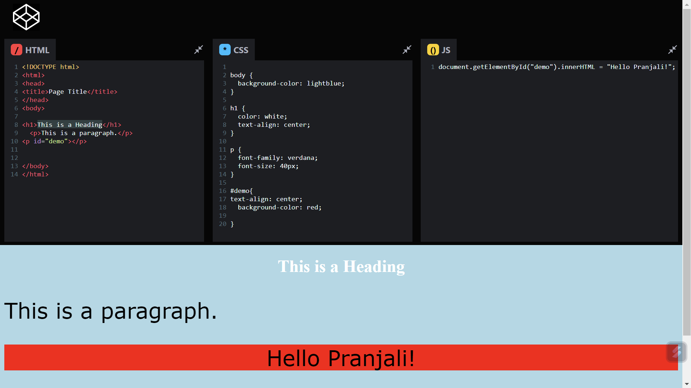

# Frontend Mentor - Room homepage solution

This is a Codepen (Online Code Editor) Clone built using React JS and and Material UI library

## Table of contents

- [Screenshot](#screenshot)
- [Links](#links)
- [Built with](#built-with)
- [What I learned](#what-i-learned)
- [Continued development](#continued-development)
- [Useful resources](#useful-resources)
- [Author](#author)

### Screenshot

### Links

- Solution URL: [ solution URL ](https://github.com/Psargar616/codepen-clone)
- Live Site URL: [ live site URL ](https://codepen-online-code-editor-clone.netlify.app/)

### Built with

- [React](https://reactjs.org/) - JS library
- [Material UI](https://mui.com/)

### What I learned

I used React JS and Material UI library to build this project. I used react basics and react hooks such as useState, useEffect,  useContext in this project. 
I learned how to use [React Codemirror](https://www.npmjs.com/package/react-codemirror2) library

### Useful resources

- [React](https://reactjs.org/)
- [Material UI](https://mui.com/)
- [React codemirror](https://www.npmjs.com/package/react-codemirror2)

### Author

- Frontend Mentor - [@Psargar616](https://www.frontendmentor.io/profile/Psargar616)
- Twitter - [@PranjaliSargar](https://twitter.com/PranjaliSargar)

### Acknowledgement

I got the idea to build a Codepen clone from this youtube video
[How To Build CodePen With React](https://youtu.be/wcVxX7lu2d4?feature=shared )